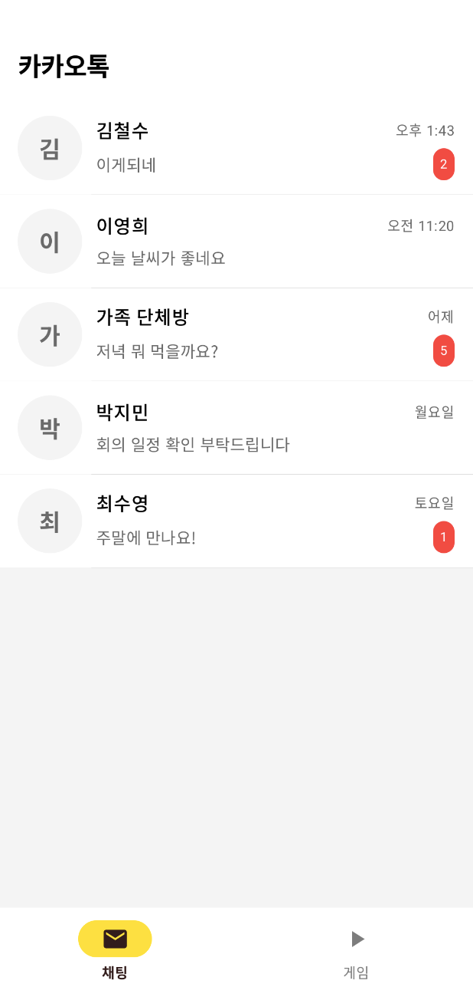
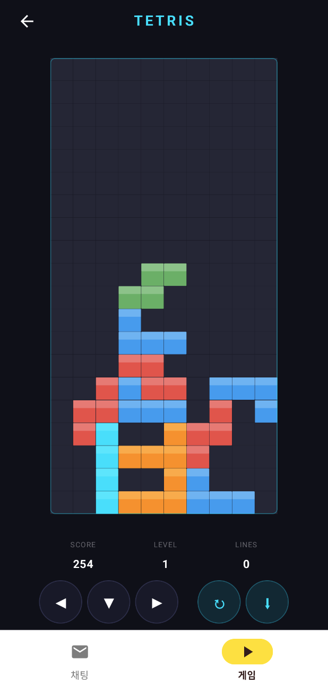
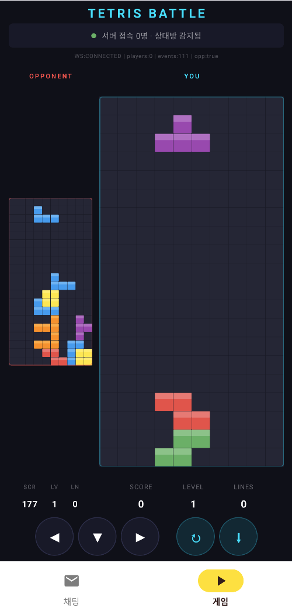

# 💬 KakaoTalk Clone

Jetpack Compose 기반 카카오톡 스타일 실시간 채팅 앱입니다.

## ✨ 주요 기능
- 채팅방 목록 조회
- 실시간 채팅 메시지 송수신 (WebSocket)
- 오프라인 메시지 큐잉 및 자동 재전송
- 지수 백오프 기반 자동 재연결
- Room 기반 로컬 메시지 캐싱
- 카카오톡 스타일 UI/UX
- 2인용 실시간 테트리스 대전 (WebSocket 보드 동기화)
- 하단 탭 네비게이션 (채팅 / 게임)

## 🧱 아키텍처
Clean Architecture + MVVM
- Presentation (Compose UI + HiltViewModel)
- Data (Repository + WebSocket + Room)
- Domain (Model)

## 🧰 기술 스택
- Jetpack Compose (Material 3)
- Hilt (DI)
- OkHttp WebSocket
- Coroutines + Flow
- Room (로컬 캐시)
- Kotlinx Serialization
- Coil (이미지 로딩)

### 📦 디렉토리 구조
```
kakaoTalk/
├── app/                            // 애플리케이션 관련 설정 및 실행
│   └── src/main/java/
│       └── com/example/kakaotalk/
│           ├── KakaoTalkApplication.kt     // @HiltAndroidApp
│           ├── MainActivity.kt             // @AndroidEntryPoint
│           ├── data/
│           │   └── repository/
│           │       └── ChatRepository.kt   // 네트워크 + 로컬 DB 조율
│           └── ui/
│               ├── chat/
│               │   ├── ChatListScreen.kt   // 채팅방 목록 화면
│               │   ├── ChatRoomScreen.kt   // 채팅방 화면
│               │   └── ChatViewModel.kt    // @HiltViewModel
│               ├── game/
│               │   ├── TetrisEngine.kt     // 테트리스 순수 게임 로직
│               │   ├── TetrisScreen.kt     // Canvas 기반 게임 UI
│               │   └── TetrisViewModel.kt  // 게임 루프 + WebSocket 동기화
│               ├── main/
│               │   └── MainScreen.kt       // 하단 탭 네비게이션
│               └── theme/                  // 카카오톡 테마 (Color, Theme, Type)
│
├── app-config/                     // 앱 설정 모듈
│   ├── app-config/                 // 앱 설정 구현 (BuildConfig, Hilt Module)
│   └── app-config-api/             // 앱 설정 인터페이스 (AppConfig)
│
├── build-logic/                    // 빌드 로직 및 Convention Plugin
│   └── src/main/kotlin/            // Application, Library, Compose, Hilt 플러그인
│
├── core/                           // 애플리케이션 전반에서 공통적으로 사용되는 core 모듈
│   ├── base/                       // 화면 등 기본 클래스
│   ├── database/                   // Room DB, Entity, DAO, Hilt Module
│   ├── designsystem/               // 디자인 시스템 (컬러, 폰트, 스타일)
│   ├── model/                      // 도메인 모델 (ChatRoom, ChatMessage, SocketCommand, SocketEvent)
│   ├── navigation/                 // 네비게이션 (Jetpack Navigation)
│   ├── network/                    // WebSocket 클라이언트, ChatSocketService, Hilt Module
│   ├── resource/                   // 리소스 (이미지, 문자열)
│   ├── testing/                    // 테스팅 유틸
│   ├── ui/                         // 공유 UI 컴포넌트
│   └── utils/                      // 유틸리티 함수
│
└── gradle/                         // Gradle 설정
    ├── libs.versions.toml          // 의존성 버전 관리
    └── dependencyGraph.gradle      // 의존성 그래프 생성
```

## 🔌 소켓 아키텍처

```
┌────────────────────────────────────────────────────────────┐
│                      Presentation                          │
│  ChatViewModel ──── ChatRepository                         │
│       │                  │           │                     │
│       ▼                  ▼           ▼                     │
│  Compose UI     ChatSocketService  Room DAO                │
│                      │                                     │
├──────────────────────┼─────────────────────────────────────┤
│                      │          Network Layer               │
│              WebSocketClient                               │
│              ├─ 지수 백오프 재연결 (Jitter)                  │
│              ├─ 오프라인 메시지 큐 (ConcurrentLinkedQueue)    │
│              ├─ OkHttp Ping/Pong 하트비트 (15s)             │
│              └─ SharedFlow 기반 메시지 브로드캐스트            │
└────────────────────────────────────────────────────────────┘
```

## 🚀 실행 방법

### 사전 준비
- Android Studio (Hedgehog 이상)
- JDK 17
- 실기기 2대 또는 에뮬레이터 2대 (같은 WiFi 네트워크)

### 1. 서버 실행

프로젝트 루트에서 Ktor WebSocket 중계 서버를 실행합니다.

```bash
./gradlew :server:run
```

서버가 시작되면 접속 가능한 IP가 출력됩니다.

```
┌─────────────────────────────────────────────┐
│       KakaoTalk Chat Server                 │
└─────────────────────────────────────────────┘

  Android 앱 접속 주소 → ws://192.168.0.38:8080/
  에뮬레이터 접속 주소  → ws://10.0.2.2:8080/
```

### 2. BASE_URL 설정

`app-config/app-config/build.gradle.kts`에서 dev 빌드의 `BASE_URL`을 서버 IP로 변경합니다.

```kotlin
named("dev") {
    buildConfigField("String", "BASE_URL", "\"ws://192.168.0.38:8080/\"")
}
```

| 환경 | BASE_URL |
|---|---|
| 실기기 (같은 WiFi) | `ws://<서버 IP>:8080/` |
| 에뮬레이터 | `ws://10.0.2.2:8080/` |

### 3. 앱 빌드 및 설치

```bash
./gradlew :app:assembleDevDebug
```

생성된 APK를 두 기기에 설치합니다.

### 4. 채팅 테스트

1. 서버가 실행 중인지 확인
2. 두 기기에서 앱 실행
3. 같은 채팅방에 들어가서 메시지 전송
4. 상대 기기에서 실시간으로 메시지가 표시되는지 확인

서버 터미널에서 접속/메시지 로그를 확인할 수 있습니다.

```
[+] 사용자 1 접속  (현재 1명)
[+] 사용자 2 접속  (현재 2명)
[>] 사용자 1 → room(1): 안녕하세요!
```

### 5. 테트리스 대전

1. 두 기기에서 앱 실행 → 하단 **게임** 탭 선택
2. 양쪽 모두 **게임 시작** 버튼 터치
3. 내 보드(오른쪽)에서 플레이, 상대 보드(왼쪽)가 실시간 동기화
4. 조작: ◀ 좌이동, ▶ 우이동, ↻ 회전, ▼ 소프트드롭, ⬇ 하드드롭

## Screenshots
<p align="center">
  
  
  
</p>

## 📦 의존 그래프
<p align="center">
  
</p>
